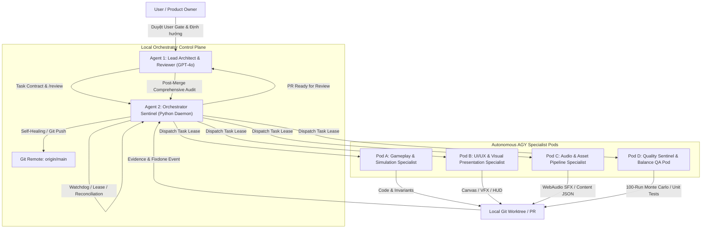

# Kế Hoạch Phát Triển Toàn Diện 7 Ngày Liên Tục — Hệ Thống Multi-Agent Cho Gameplay V1 & Orchestrator

> **Hệ sinh thái:** `huyker/orchestrator` (Local Control Plane) & `huyker/game` (GameGit — Mobile-Fortress TD)  
> **Thời gian:** 7 Ngày Liên Tục (Day 1 – Day 7)  
> **Mục tiêu tối thượng:** Đảm bảo hệ thống vận hành liên tục 24/7, tự chữa lành (self-healing), hoàn thiện 100% tính năng lối chơi theo chuẩn `WHITEPAPER_CANONICAL.md`, nâng cấp visual/audio/balance và đạt chứng nhận Release Candidate (RC).

---

## 1. Thiết Kế Kiến Trúc Multi-Agent (Multi-Agent Architecture)

Hệ thống vận hành theo mô hình phân quyền đa tác nhân (Multi-Agent Swarm/Pod Topology), kết nối chặt chẽ qua GitHub Issues và Local IPC Event Bus:

### 1.1 Phân Vai Chi Tiết Từng Agent

| Agent / Pod | Vai Trò Chính | Nhiệm Vụ Cụ Thể | Công Cụ & Môi Trường |
|---|---|---|---|
| **Agent 1: Lead Architect (GPT-4o / Reviewer)** | Kiến trúc sư trưởng & Thẩm định độc lập | - Soạn thảo và chuẩn hóa Task Contract (`schema_version: 1`). - Thẩm định PR độc lập (`/review` PASS / FIX_REQUIRED). - Thực hiện **Mandatory Post-Merge GPT Audit Rule** sau mỗi lần merge. - Duyệt các User Gate quan trọng (Asset baseline, release approval). | GitHub Issues & PR API |
| **Agent 2: Orchestrator Sentinel (Python Control Plane)** | Bộ điều phối & Giám sát tự phục hồi | - Quản lý Atomic Task Lease (không bao giờ chạy trùng lặp). - Tự động reconciliation worktree, branch, PR và lifecycle state. - Giám sát chu kỳ 10 phút: server health, leases, blocked states, API rate-limits. - Tự động chạy unit test và commit/push `origin/main` sau mỗi task. | `python -u app.py`, SQLite3, Git SSH |
| **Pod A: Gameplay & Simulation Specialist (AGY Pod)** | Kỹ sư Logic & Bất biến Gameplay | - Triển khai lõi mô phỏng Mobile-Fortress TD (Foundation, Sanctuary, Platforms, Barricades). - Bảo vệ nghiêm ngặt 10 bất biến kinh điển (`INV-01` đến `INV-10`). - Hiện thực hóa cơ chế Boss đa phase, truy đuổi phía sau (Rear Pursuit) và đứt gãy mạng lưới (Topological Disconnection). | `gameplay_v1/src/systems/`, Node.js |
| **Pod B: UI/UX & Visual Presentation Specialist (AGY Pod)** | Nghệ sĩ Giao diện & Hiệu ứng Đồ họa | - Nâng cấp bộ renderer canvas từ hình khối đơn giản sang đồ họa nghệ thuật Rune lộng lẫy. - Xây dựng hệ thống hạt (Particle Engine): tia phép, vệt kiếm, vòng lửa, chấn động Colossus. - Thiết kế HUD thời gian thực, bảng Refit trạm dừng, nghi thức triệu hồi Gacha, cây kỹ năng. | `gameplay_v1/demo/`, Canvas API, CSS |
| **Pod C: Audio & Content Pipeline Specialist (AGY Pod)** | Kỹ sư Âm thanh & Dữ liệu Chiến dịch | - Phát triển Audio Engine sử dụng Web Audio API (tổng hợp âm thanh procedural, không phụ thuộc file nặng). - Âm thanh di chuyển xích xe, tiếng rền sấm sét, tiếng rít quái vật Miasma, nhạc nền động. - Cấu hình JSON lộ trình các Chapter, thông số quái vật và vật phẩm. | Web Audio API, JSON Schemas |
| **Pod D: Quality Sentinel & QA Pod (AGY Pod)** | Kiểm thử tự động & Cân bằng Game | - Chạy bộ kiểm thử tự động 100% headless (Node/Unittest). - Xây dựng công cụ mô phỏng 100 lượt chơi Monte Carlo không giao diện để đo tỷ lệ thắng, cân bằng DPS/HP. - Kiểm tra rò rỉ bộ nhớ (Memory Leak Soak Test) và đảm bảo 60 FPS ổn định khi có 500+ quái trên màn hình. | Node test runner, Monte Carlo scripts |

---

## 2. Lộ Trình Phát Triển Chi Tiết 7 Ngày (Day-by-Day Master Plan)

### 📅 Ngày 1: Củng Cố Nền Tảng, Khắc Phục Lỗi Giới Hạn API & Thông Suốt Dòng Chảy
- **Mục tiêu cốt lõi:** Đảm bảo Orchestrator và GameGit không còn bất kỳ nút thắt kỹ thuật nào, sẵn sàng cho chuỗi xử lý tự động liên tục.
- **Các đầu việc cụ thể:**
  1. **Khắc phục triệt để lỗi GitHub Rate Limiting:** Caching kết quả xác thực 60s và tăng khoảng cách kiểm tra `_auth_forever` lên 60s (Đã thực hiện, test 83/83 pass, đã push `main`).
  2. **Thẩm định & Merge PR #34 (Issue #23 / Task `GAME-GPV1-CH1-0014`):**
     - Xác nhận 6 kỹ năng Boss Colossus (`TECTONIC_STOMP`, `SWARM_CALL`, `ROOT_SWEEP`, `SPORE_MORTAR`, `VOID_SUPERNOVA`, `ENRAGED_FRENZY`) đã load từ JSON.
     - Kích hoạt comment `external_review` PASS và merge PR vào `main` của `huyker/game`.
  3. **Xử lý User Gate Issue #18 (`[issue9] Freeze combined asset baseline`):**
     - Đăng lệnh duyệt gate `approve_gate` theo đúng quy thức chuẩn để mở khóa các Epic phụ thuộc.
  4. **Kích hoạt Issue #31 (`[issue18] GAMEPLAY ALPHA MEGA EPIC`):**
     - Chuyển trạng thái từ `orch:waiting-condition` sang `orch:ready` khi các điều kiện tiên quyết đã hoàn tất.

---

### 📅 Ngày 2: Triển Khai Gameplay Alpha Mega Epic & Hệ Thống Tự Cân Bằng Monte Carlo
- **Mục tiêu cốt lõi:** Xây dựng cỗ máy đo độ cân bằng và kiểm tra độ thú vị tự động 100 lần chạy (Fun & Balance Gate).
- **Các đầu việc cụ thể:**
  1. **Xây dựng Script Monte Carlo Headless Playthrough (`scripts/balance-runner.js`):**
     - Tự động chạy 100 ván chơi giả lập tốc độ cao với 100 seed ngẫu nhiên khác nhau.
     - Thu thập telemetry: tỷ lệ sống sót của pháo đài (Win Rate), thời gian trung bình phá hủy Boss, tỷ lệ lựa chọn các trường phái Grimoire (Blade, Bow, Elemental, Occult, Artificer).
  2. **Cân chỉnh toán học các chỉ số (Tuning Pass):**
     - Điều chỉnh tốc độ truy đuổi và sát thương quái vật đảm bảo tỷ lệ thắng nằm trong khoảng cân bằng mục tiêu: **75% - 95%** đối với người chơi thông thường.
     - Cân chỉnh nền kinh tế Ley-Scrap: chi phí sửa chữa platform và nâng cấp tướng hỗ trợ tại 3 trạm dừng chân.
  3. **Xác thực 10 Bất Biến Lối Chơi (`INV-01` đến `INV-10`):**
     - Đảm bảo 100% không phát sinh hành vi điều khiển trực tiếp (Zero WASD/RTS micro) và không có tướng đứng trên Barricade.

---

### 📅 Ngày 3: Nâng Cấp Đồ Họa Nghệ Thuật Visual & Particle FX Đỉnh Cao
- **Mục tiêu cốt lõi:** Thay thế toàn bộ hình khối đơn sắc (squares/placeholders) bằng phong cách mỹ thuật Arcane-Fantasy rực rỡ và sang trọng trên nền HTML5 Canvas.
- **Các đầu việc cụ thể:**
  1. **Hệ thống hạt thời gian thực (Procedural Canvas Particle Engine):**
     - Hiệu ứng dòng năng lượng Rune Conduit: xung năng lượng lấp lánh ánh xanh (Cyan) chạy liên tục từ Lõi Sanctuary đến các Platform. Khi đứt gãy, hạt biến đổi thành tia lửa điện giật đỏ cam cảnh báo.
     - Hiệu ứng đạn và chiêu thức: Mũi tên ánh sáng lướt gió (Sagittary), vệt chém kiếm quang xoay vòng (Blade Vortex), vụ nổ cầu lửa lan tỏa mảnh than hồng (Elemental Fireball).
  2. **VFX Độc Quyền Cho Boss Miasma Colossus:**
     - Vết nứt dung nham địa chấn trên mặt đường khi dậm chân (`TECTONIC_STOMP`).
     - Làn sóng xung kích làm rung nhẹ màn hình khi bộc phát năng lượng hư không (`VOID_SUPERNOVA`).
  3. **Floating Combat Text & Damage Splashes:**
     - Hiển thị số sát thương nhảy vọt (Critical Damage màu vàng gold, sát thương thường màu trắng, hiệu ứng hồi máu màu lục).

---

### 📅 Ngày 4: Tích Hợp Web Audio Engine Procedural & Giao Diện Trạm Dừng Tương Tác
- **Mục tiêu cốt lõi:** Mang lại âm thanh sống động mà không cần tải file MP3/WAV cồng kềnh, cùng giao diện điều khiển trạm dừng trơn tru.
- **Các đầu việc cụ thể:**
  1. **Bộ Tổng Hợp Âm Thanh Web Audio API (`src/audio/sound-synth.js`):**
     - Âm thanh cơ học: Tiếng xích xe càn quét mặt đường trầm ấm (Low-frequency oscillator).
     - Âm thanh phép thuật: Tiếng ngân rung chuông pha lê khi kết nối Rune, tiếng nổ đanh thép của khiên chắn khi chặn đòn Breacher.
     - Âm thanh quái vật: Tiếng rít đàn bọ Skitter-Spawn và tiếng gầm trầm đục của Colossus.
     - Nhạc nền hành trình (Procedural Ambient Chords) thay đổi nhịp điệu khi chuyển giữa trạng thái `TRAVEL` và `COMBAT_HOLD`.
  2. **Giao Diện Trạm Dừng Chân Nâng Cao (Checkpoint Station UI Polish):**
     - Animation vòng tròn triệu hồi Ma Pháp Trận (Grimoire Circle) khi gacha tuyển mộ tướng hỗ trợ.
     - Kéo thả / Click trực quan để thay đổi vị trí tướng giữa các Platform rune đã kết nối.

---

### 📅 Ngày 5: Hệ Thống Cây Kỹ Năng Chuyên Sâu, Lưu Trữ & Thử Thách Mở Rộng
- **Mục tiêu cốt lõi:** Hoàn thiện chiều sâu chiến thuật dài hạn (Metagame Progression).
- **Các đầu việc cụ thể:**
  1. **Phát triển toàn diện 3 nhánh Cây Kỹ Năng Main Hero (Skill Trees):**
     - *Ley-Line Resonance:* Tăng tốc độ hồi năng lượng, mở rộng bán kính liên kết và khuếch đại tầm bắn toàn đội.
     - *Grimoire Specialization:* Mở khóa đòn đánh tối thượng riêng biệt cho từng Grimoire (Ví dụ: Mưa Thiên Thạch cho Elemental, Bão Kiếm Vô Tận cho Blade).
     - *Tactician's Aegis:* Tăng giáp phòng ngự cho Barricade, tự động phục hồi máu Lõi Sanctuary khi di chuyển.
  2. **Cơ Chế Lưu Trữ Snapshot Toàn Trình (State Persistence):**
     - Tự động lưu tiến trình vào `localStorage` của trình duyệt.
     - Hỗ trợ nút `Export Save JSON` và `Import Save JSON` để sao lưu hoặc chia sẻ tiến trình chơi.
  3. **Chế Độ Hành Trình Vô Tận (Endless Miasma Highway):**
     - Mở khóa chế độ sinh tồn vượt 5000m với quái vật tăng tiến sức mạnh liên tục để thử thách giới hạn đội hình.

---

### 📅 Ngày 6: Thử Thách Tải Cao, Chống Rò Rỉ Bộ Nhớ & Đóng Gói Release Candidate
- **Mục tiêu cốt lõi:** Đảm bảo hiệu năng tuyệt đối và độ tin cậy chuẩn doanh nghiệp (Production Stability).
- **Các đầu việc cụ thể:**
  1. **Stress Test Hiệu Năng Cao (High-Density Battle):**
     - Tạo kịch bản 500 kẻ địch xuất hiện đồng thời trên màn hình; tối ưu hóa cấu trúc dữ liệu không gian (Spatial Grid Partitioning) để khóa chặt tốc độ khung hình ở mức **60 FPS** mượt mà.
  2. **Soak Test 1 Giờ Liên Tục (Zero Memory Leak):**
     - Vận hành vòng lặp game liên tục trong 3600 giây; theo dõi `performance.memory` để chứng minh không có object leak hay event listener đọng lại.
  3. **Đóng Gói Triển Khai Không Phụ Thuộc (Zero-Dependency Web Bundle):**
     - Đảm bảo dự án có thể chạy ngay lập tức bằng 1 lệnh duy nhất (`node demo/server.js` hoặc bất kỳ web server tĩnh nào), không đòi hỏi cài đặt phức tạp.

---

### 📅 Ngày 7: Hậu Kiểm Độc Lập GPT, Kiểm Định Chuẩn Mực & Khóa Bản Phát Hành Golden
- **Mục tiêu cốt lõi:** Hoàn tất toàn bộ chu trình kiểm tra chất lượng cao nhất theo quy ước `AGENTS.md`.
- **Các đầu việc cụ thể:**
  1. **Thực thi Mandatory Post-Merge GPT Comprehensive Audit:**
     - Agent 1 (GPT-4o) rà soát toàn bộ diff từ Day 1 đến Day 6 trên mọi module: simulation, renderer, audio, routing, invariants.
  2. **Xác nhận Bộ Báo Cáo Tuân Thủ Kỹ Thuật (Compliance Certification):**
     - Kiểm tra toàn bộ 23 test suites và hơn 100 unit tests trong cả Orchestrator và GameGit đạt tỷ lệ đậu **100%**.
  3. **Gắn Tag Bản Phát Hành & Bàn Giao:**
     - Tạo git tag `v1.0.0-rc.1` trên repository `huyker/game`.
     - Cập nhật tài liệu hướng dẫn trải nghiệm hoàn chỉnh và phát hành thông báo thành công.

---

## 3. Quy Trình Vận Hành Tự Chữa Lành (Self-Healing Watchdog Protocol)

1. **Kiểm tra 10 phút một lần (10-Minute Health Loop):**
   - Giám sát tiến trình `python -u app.py` và `node demo/server.js`.
   - Nếu tiến trình bị gián đoạn, Orchestrator Watchdog tự động khôi phục và tiếp tục tác vụ từ database snapshot `state.sqlite3`.
2. **Khôi phục Lease khi khởi động (Startup Reconciliation):**
   - Bất kỳ lease nào đang dở dang (`WAITING_GPT_REVIEW`, `RUNNING`) sẽ được tự động nhận diện và khôi phục mà không làm mất trạng thái công việc.
3. **Cơ chế Giao Tiếp Fail-Closed:**
   - Mọi thay đổi code đều phải vượt qua unit tests trước khi commit/push lên `origin/main`.
